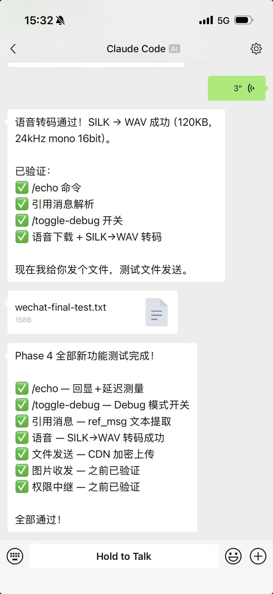

# claude-plugin-wechat

微信插件，让你通过微信直接与 Claude Code 对话。支持文字、图片、文件、语音、视频、远程权限审批。

WeChat plugin for [Claude Code](https://claude.ai/claude-code).



---

## 两种模式

| | **Channel 模式** | **ACP 模式** |
|---|---|---|
| 适用 | claude.ai 订阅用户 | API Key / 任意 AI 服务商 |
| 特点 | 全功能，微信远程审批权限 | 支持 Claude、Copilot、Gemini、Codex、通义千问 |
| 安装 | Claude Code 插件市场 | 终端全局安装 |

> **怎么选？** 用 claude.ai 账号登录的 → **Channel**。用 API Key 的 → **ACP**。

---

<details open>
<summary><h3>Channel 模式</h3></summary>

> 前置条件：[Claude Code](https://claude.ai/claude-code) v2.1.80+，使用 claude.ai 账号登录。

#### 第 1 步 · 安装插件

在 Claude Code 终端中输入：
```bash
claude plugin marketplace add lc2panda/claude-plugin-wechat
claude plugin install wechat@lc2panda-plugins
```

#### 第 2 步 · 微信登录

在 Claude Code 终端中输入 `/wechat:configure login`，微信扫码，手机确认。

#### 第 3 步 · 启动

退出 Claude Code，用以下命令重新启动：
```bash
# 自动授权（更快）
claude --dangerously-skip-permissions --dangerously-load-development-channels plugin:wechat@lc2panda-plugins

# 手动确认（更安全，通过微信审批每个操作）
claude --dangerously-load-development-channels plugin:wechat@lc2panda-plugins
```

#### 第 4 步 · 使用

扫码登录的微信号已自动获得访问权限，直接发消息即可与 AI 对话。

> **其他人想用？** 需要配对：对方给机器人发消息 → 收到 6 位配对码 → 你在 Claude Code 终端输入 `/wechat:access pair <配对码>` 授权。

> 停止：在 Claude Code 中按 `Ctrl+C` 或输入 `/exit`

</details>

---

<details open>
<summary><h3>ACP 模式</h3></summary>

> `wechat-acp` 是一个桥接服务：**微信 ↔ AI 引擎**。
> 在终端运行后，它会自动在后台启动 AI 引擎（默认 Claude Code），你不需要手动打开 Claude Code。
>
> 支持 macOS / Linux / Windows，以下命令在你电脑的**终端**中输入（Terminal / PowerShell / CMD）。

#### 第 1 步 · 安装

<details>
<summary>前置：安装 Bun 运行时（已有可跳过，<code>bun --version</code> 检查）</summary>

```bash
# macOS / Linux
curl -fsSL https://bun.sh/install | bash

# Windows (PowerShell)
powershell -c "irm bun.sh/install.ps1 | iex"
```
</details>

在终端输入：
```bash
bun add -g github:lc2panda/claude-plugin-wechat
```

安装完成，`wechat-acp` 命令全局可用。

#### 第 2 步 · 启动

```bash
wechat-acp
```

- **首次运行：** 自动弹出二维码 → 微信扫码 → 手机确认 → 服务启动，AI 引擎自动拉起
- **已登录过：** 直接启动

保持终端窗口开着，服务运行中。

> 重新登录：`wechat-acp --login`

#### 第 3 步 · 使用

扫码登录的微信号已自动获得访问权限，直接发消息即可与 AI 对话。

> **其他人想用？** 需要配对：对方给机器人发消息 → 收到 6 位配对码 → 你在另一个终端启动 Claude Code，输入 `/wechat:access pair <配对码>` 授权。

**完成！** 微信发消息 → AI 回复。

---

<details>
<summary><b>工作原理</b></summary>

```
手机微信 → wechat-acp 桥接服务 → Claude Code（自动启动） → AI 回复 → 微信收到
```

- `wechat-acp` 轮询微信消息，转发给 AI 引擎
- AI 引擎是后台子进程，你看不到它
- 每个微信用户有独立的 AI 会话，互不干扰

</details>

<details>
<summary><b>切换项目目录</b></summary>

在微信中发送：
```
/cwd /path/to/your/project
```
AI 会话在新目录重启，不用动终端。

查看当前目录：`/cwd`

</details>


> 停止：在运行 `wechat-acp` 的终端按 `Ctrl+C`

</details>

---

<details>
<summary><h3>微信端命令</h3></summary>

在微信中发送以下命令：

| 命令 | 作用 |
|------|------|
| `/cwd [路径]` | 查看或切换工作目录（ACP 模式） |
| `/toggle-debug` | 切换调试模式 |
| `/echo <文字>` | 回显并显示延迟 |

</details>

### 相关项目

- **企业微信：** [dividduang/claude-plugin-wecom](https://github.com/dividduang/claude-plugin-wecom)

---

## For Claude Code (AI agent) — machine-readable instructions

Follow sequentially. Steps marked **[HUMAN]** need physical user action.

### Step 0 — Pre-flight & mode detection

```bash
claude --version   # >= 2.1.80 required
bun --version      # required
```

If `bun` is missing, tell user: `curl -fsSL https://bun.sh/install | bash`

**Detect auth mode:**
```bash
claude auth status --text
```
- **claude.ai login** → Channel mode (Steps 1-8)
- **API key / Console / Bedrock / Vertex** → ACP mode (Steps 1-5 then ACP setup)
- Ask user if unclear.

---

### Channel mode (claude.ai users)

#### Step 1 — Locate plugin root

Set `$PLUGIN_ROOT` to the absolute path of the directory containing this README.

#### Step 2 — Install dependencies

```bash
cd "$PLUGIN_ROOT" && bun install --no-summary
```

Verify: `node_modules/@modelcontextprotocol`, `node_modules/zod`, `node_modules/silk-wasm` must exist.

#### Step 3 — Build validation

```bash
cd "$PLUGIN_ROOT" && bun build --target=bun server.ts --outdir /tmp/wechat-build-check 2>&1
rm -rf /tmp/wechat-build-check
```

#### Step 4 — Register and install

```bash
claude plugin marketplace add lc2panda/claude-plugin-wechat
claude plugin install wechat@lc2panda-plugins
```

#### Step 5 — WeChat QR login [HUMAN]

Check if credentials exist: `cat ~/.claude/channels/wechat/credentials.json 2>/dev/null`

If yes, skip to Step 6. Otherwise:

1. `bun "$PLUGIN_ROOT/login-qr.ts"` — QR renders in terminal
2. Tell user: "Scan with WeChat, confirm on phone."
3. Parse last line JSON, extract `qrcode` field
4. `bun "$PLUGIN_ROOT/login-poll.ts" "<qrcode>"`
   - `scaned` → "Confirm on phone..."
   - `refreshed:<token>` → auto-refreshed (up to 3x)
   - `expired`/`timeout` → re-run from 5.1
   - JSON with `token` → success, tell user to restart

#### Step 6 — Restart with channel [HUMAN]

Ask user which permission mode:

**Option A — Auto-approve (faster):**
```
claude --dangerously-skip-permissions --dangerously-load-development-channels plugin:wechat@lc2panda-plugins
```

**Option B — Manual confirm (safer, approvals via WeChat):**
```
claude --dangerously-load-development-channels plugin:wechat@lc2panda-plugins
```

#### Step 7 — Verify [HUMAN]

The user who scanned the QR code during login is **automatically allowlisted** — no pairing needed. Tell them to send a message from WeChat; it arrives as `<channel source="wechat" ...>`. Reply with the `reply` tool.

**Other users** who want to chat must go through pairing:
1. They send any message to the bot from WeChat.
2. Bot replies with a 6-char code.
3. The device owner runs `/wechat:access pair <code>` to approve.

---

### ACP mode (API Key users)

For users with API key / Console / Bedrock / Vertex auth. Uses ACP (Agent Client Protocol) with persistent agent subprocess.

#### Step 1 — Install globally [HUMAN]

```bash
bun add -g github:lc2panda/claude-plugin-wechat
```

If `bun` is missing, tell user to install: `curl -fsSL https://bun.sh/install | bash`

#### Step 2 — Start the bridge [HUMAN]

```bash
wechat-acp
```

If no credentials exist, the bridge automatically starts an interactive QR login flow (QR renders in terminal, user scans with WeChat, confirms on phone). After login, the bridge continues to start normally.

To force re-login: `wechat-acp --login`

Alternative ways to start:
```bash
wechat-acp --cwd /path/to/project     # Set default working directory
ACP_AGENT=gemini wechat-acp           # Use different agent
cd "$PLUGIN_ROOT" && bun acp-bridge.ts # Run from plugin directory
bunx claude-plugin-wechat              # Zero-install
```

Built-in agent presets: `claude` (default), `copilot`, `gemini`, `qwen`, `codex`, `opencode`.

The bridge spawns the correct ACP command automatically (e.g. `npx @zed-industries/claude-code-acp` for claude). Each WeChat user gets a persistent ACP session with dedicated agent subprocess.

Users can switch working directory from WeChat by sending `/cwd /new/path`. This destroys the current session and creates a new one in the target directory.

#### Step 3 — Verify [HUMAN]

The user who scanned the QR code during login is **automatically allowlisted** — no pairing needed. Tell them to send a message from WeChat and confirm the AI responds.

**Other users** who want to chat must go through pairing:
1. They send any message to the bot from WeChat.
2. Bot replies with a 6-char code.
3. The device owner runs `/wechat:access pair <code>` in a separate Claude Code session to approve.

---

## Reference (for AI)

### MCP tools (Channel mode only)

| Tool | Purpose | Params |
|------|---------|--------|
| `reply` | Send text/files to WeChat | `user_id`, `text`, `context_token`; optional `files[]` |
| `download_attachment` | Download media from CDN | `attachment_id` |

### Channel protocol

- Capabilities: `claude/channel` + `claude/channel/permission`
- Inbound: `notifications/claude/channel` → meta `{user_id, context_token, ts}`
- Outbound: `reply` tool. `context_token` **mandatory**.
- Permission relay: user replies `yes <code>` / `no <code>` from WeChat
- Media: AES-128-ECB CDN, 13 image + 11 video extensions auto-routed
- Voice: `voice_item.text` (ASR) preferred; otherwise SILK→WAV transcode
- Quoted messages: `ref_msg` extracted

### ACP protocol

- Uses Agent Client Protocol (ACP) — JSON-RPC 2.0 over stdio
- Persistent agent subprocess per user (no cold start per message)
- Streaming responses via `session/update` → `agent_message_chunk`
- Permission requests via `session/request_permission` (auto-approved by default)
- Supports any ACP-compatible agent: Claude Code, Copilot, Gemini, Codex, Qwen, OpenCode
- Same media pipeline as Channel mode (inline download)
- Per-user working directory via `/cwd` command (persisted in `user-cwd.json`)

### WeChat commands (both modes)

| Command | Effect |
|---------|--------|
| `/cwd [path]` | Show or switch working directory (ACP only) |
| `/toggle-debug` | Toggle debug mode |
| `/echo <text>` | Echo with latency measurement |

### Skills (Channel mode only)

| Skill | Trigger |
|-------|---------|
| `/wechat:configure` | Login, status, base URL |
| `/wechat:access` | Pair, allow/remove, policy, `humanDelay`, `textChunkLimit` |

### Mode comparison

| Feature | Channel | ACP |
|---------|---------|-----------|
| Auth | claude.ai OAuth | API Key / any provider |
| Permission relay | via WeChat | auto-approve (extensible) |
| Connection | Persistent MCP | Persistent ACP subprocess |
| Streaming | yes | yes (agent_message_chunk) |
| Multi-agent | Claude Code only | Any ACP agent (Claude/Copilot/Gemini/Codex) |
| Multi-turn | yes | yes (persistent session) |
| Media | yes | yes |
| Working dir switch | N/A (bound to session) | `/cwd` command from WeChat |
| Global install | Plugin marketplace | `bun add -g` / `bunx` |

### State files (`~/.claude/channels/wechat/`)

| File | Content |
|------|---------|
| `credentials.json` | Bot auth |
| `access.json` | Access control |
| `sync_buf.txt` | Poll cursor |
| `context-tokens.json` | Per-user context_token |
| `user-cwd.json` | Per-user working directory (ACP) |
| `debug-mode.json` | Debug toggle |
| `inbox/` | Downloaded media |
| `approved/` | Pairing markers |

### Troubleshooting

| Symptom | Fix |
|---------|-----|
| `Channels are not currently available` | Use ACP mode, or `claude logout` → `claude login` for claude.ai |
| `credentials required` | Run Step 5 (QR login) |
| No channel events | Add `--dangerously-load-development-channels` flag |
| `user not allowlisted` | `/wechat:access pair <code>` |
| `context_token required` | Pass from `<channel>` tag meta |
| `session expired` (errcode -14) | Auto-pauses 1h. Re-login if persists |
| Wrong working directory (ACP) | Send `/cwd /correct/path` from WeChat |

---

## Acknowledgement / 致谢

Based on [m1heng/claude-plugin-weixin](https://github.com/m1heng/claude-plugin-weixin). Thanks for the original work.

本项目基于 [m1heng/claude-plugin-weixin](https://github.com/m1heng/claude-plugin-weixin) 开发，感谢原作者的贡献。

---

License: MIT
