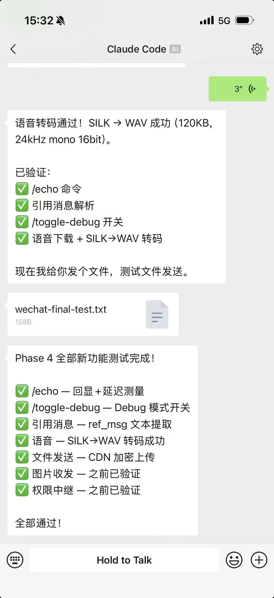

**此项目的任何功能、架构更新，必须在结束后同步更新相关文档。这是我们契约的一部分。**

---

<!--
# AI Installation Instructions (Machine-Readable)

以下内容供 AI Agent（Claude Code / Codex）自动执行安装和配置。

---

## 第 0 步 · 环境检测与平台识别

```bash
# 检测运行平台
ls ~/.pandacc 2>/dev/null && echo "Codex" || echo "Claude Code"

# 必须依赖
which bun || echo "需要 Bun: curl -fsSL https://bun.sh/install | bash"
```

**状态目录映射：**

| 平台 | 渠道状态目录 | 插件安装目录 |
|------|-------------|-------------|
| Codex | `~/.pandacc/channels/` | `~/.codex/plugins/cache/lc2panda-plugins/wechat/*/` |
| Claude Code | `~/.claude/channels/` | `~/.claude/plugins/cache/lc2panda-plugins/wechat/*/` |

---

## `.mcp.json` 平台差异说明

`.mcp.json` 同时服务于 Codex 和 Claude Code 两个平台：

- **Claude Code**：读取项目根目录 `.mcp.json`，通过 `${CLAUDE_PLUGIN_ROOT}` 定位插件目录启动 MCP。
- **Codex**：通过 `.codex-plugin/plugin.json` 中的 `mcpServers` 字段发现 `.mcp.json`。`${CLAUDE_PLUGIN_ROOT:-.}` 的 shell 兜底语法确保 Codex（无此变量时回退到当前目录）也能正确解析插件路径。

插件安装并重启 Codex 会话后，MCP 服务器自动注册，无需手动配置。

如果 Codex 渠道未自动启动，排查：
- 是否已**重启 Codex 会话**（插件安装/更新后必须重启，否则新技能/MCP 不生效）
- `~/.pandacc/channels/wechat/credentials.json` 或 `~/.pandacc/channels/feishu/credentials.json` 是否存在
- 插件 `plugin.json` 中是否包含 `"mcpServers": "./.mcp.json"` 字段（v2.1.5+）

---

**询问用户：**
1. 需要接入哪个渠道？微信 / 飞书 / 都要？
2. 使用哪种模式？Channel（插件内直接收发）/ ACP（独立进程，支持多 Agent）？

根据回答，执行对应路径。

---

## 渠道模式（Channel Mode）— Claude Code / Codex 通用

### 步骤 1 — 安装插件

```
/plugin marketplace add lc2panda/claude-plugin-wechat
/plugin install wechat@lc2panda-plugins
```

找不到 marketplace 时先 `/plugin marketplace update lc2panda/claude-plugin-wechat`。安装后 `/reload-plugins`。

### 步骤 2 — 配置渠道

按用户选择的渠道执行对应配置。

---

## 微信 · Channel 模式

### 微信登录 [需人类操作]

检查凭据（根据平台选择目录）：
- Codex: `cat ~/.pandacc/channels/wechat/credentials.json 2>/dev/null`
- Claude Code: `cat ~/.claude/channels/wechat/credentials.json 2>/dev/null`

有凭据则跳过。否则告诉用户执行 `/wechat:configure login` — 终端显示二维码，微信扫码，手机确认。

### 启动 [需人类操作]

- **Claude Code**: `claude --dangerously-skip-permissions --dangerously-load-development-channels plugin:wechat@lc2panda-plugins`
- **Codex**: 插件安装后 Codex 通过 `plugin.json` 的 `mcpServers` 字段自动发现并启动 MCP 渠道服务器，无需额外启动参数。通知用户重启 Codex 会话。

### 验证

扫码登录的微信号**自动在白名单中**，无需配对。告诉用户从微信发消息，消息到达后以 `<channel source="wechat" ...>` 格式出现，用 `reply` 工具回复。

其他用户需配对：发消息 → 收到 6 位配对码 → 机主执行 `/wechat:access pair <配对码>`。

---

## 飞书/Lark · Channel 模式

### 配置凭据 [需人类操作]

检查凭据（根据平台）：
- Codex: `cat ~/.pandacc/channels/feishu/credentials.json 2>/dev/null`
- Claude Code: `cat ~/.claude/channels/feishu/credentials.json 2>/dev/null`

有凭据则跳过。否则告诉用户执行 `/feishu:configure login`，输入 App ID 和 App Secret。

如果用户还没有飞书应用，引导：
1. 飞书开放平台（open.feishu.cn）或 Lark Developer（open.larksuite.com）创建自建应用。Lark 用户需执行 `/feishu:configure domain lark` 切换域名
2. 权限管理 → 批量导入 JSON：`{"scopes":{"tenant":["im:message","im:message.p2p_msg:readonly","im:message.group_at_msg:readonly","im:message:send_as_bot","im:resource"]}}`
3. 事件与回调 → 订阅方式 → 使用长连接接收事件 → 添加 `im.message.receive_v1`
4. 版本管理 → 创建版本 → 发布

### 启动 [需人类操作]

- **Claude Code**: `claude --dangerously-skip-permissions --dangerously-load-development-channels plugin:wechat@lc2panda-plugins`
- **Codex**: 插件安装后自动加载，重启 Codex 会话即可。

此命令同时加载微信和飞书两个渠道。

### 验证

飞书消息以 `<channel source="feishu" user_id="..." chat_id="..." ts="...">` 格式到达。用 `reply` 工具回复，必须传 `chat_id`。

首次用户需配对（同微信机制），配对后自动授权。

---

## ACP 模式 — 通用（Claude Code / Codex / Copilot / Gemini / Qwen / Opencode）

ACP 模式启动独立进程，不依赖 Claude Code 或 Codex 会话。支持所有 ACP 兼容 Agent。

### 步骤 1 — 全局安装 [需人类操作]

```bash
bun add -g github:lc2panda/claude-plugin-wechat
```

### 步骤 2 — 配置渠道

按上述微信/飞书 Channel 模式的凭据配置步骤操作。

### 步骤 3 — 启动 [需人类操作]

**微信：**
```bash
wechat-acp                          # 默认 Claude agent
ACP_AGENT=codex wechat-acp          # 使用 Codex agent
ACP_AGENT=copilot wechat-acp        # 使用 Copilot agent
ACP_AGENT=gemini wechat-acp         # 使用 Gemini agent
```

**飞书：**
```bash
feishu-acp                          # 默认 Claude agent
ACP_AGENT=codex feishu-acp          # 使用 Codex agent
```

**其他启动选项：**
```bash
wechat-acp --login                  # 重新扫码登录
wechat-acp --cwd /项目路径          # 指定工作目录
```

无凭据时自动弹出二维码登录。

### 步骤 4 — 验证

同 Channel 模式。IM 端发 `/cwd /新路径` 可切换工作目录。

---

## 更新插件

| 模式 | 命令 |
|------|------|
| Channel（Claude Code） | `/plugin marketplace update lc2panda-plugins` → `/plugin install wechat@lc2panda-plugins` → 重启 Claude Code |
| Channel（Codex） | `/plugin marketplace update lc2panda-plugins` → `/plugin install wechat@lc2panda-plugins` → 重启 Codex |
| ACP | `bun add -g github:lc2panda/claude-plugin-wechat` → 重启 wechat-acp / feishu-acp |

---

## 参考（AI 用）

### 工具

| 工具 | 渠道 | 参数 |
|------|------|------|
| `reply` | 微信 | `user_id`, `text`, `context_token`（可选，v2.1.3+）; `files[]`（可选） |
| `reply` | 飞书 | `user_id`, `text`, `chat_id`（必填）; `files[]`（可选） |
| `download_attachment` | 全部 | `attachment_id` |

### 微信协议

- 能力声明：`claude/channel` + `claude/channel/permission`
- 入站：`notifications/claude/channel` → meta `{user_id, context_token, ts}`
- 出站：`reply` 工具，`context_token` 可选
- 权限中继：用户回复 `yes <code>` / `no <code>`
- Typing：每 5 秒 keepalive，回复后取消，5 分钟安全超时
- 媒体：AES-128-ECB CDN，13 种图片 + 11 种视频格式
- 语音：优先 ASR 文本，否则 SILK→WAV 转码
- 引用消息：`ref_msg` 提取

### 飞书协议

- 能力声明：`claude/channel` + `claude/channel/permission`
- 入站：`notifications/claude/channel` → meta `{user_id, chat_id, ts}`
- 出站：`reply` 工具，`chat_id` 必填
- 权限中继：卡片按钮（i18n_elements + button）+ 文字回退
- Typing：emoji reaction（Typing 表情），回复后移除
- 媒体：平台托管（无加密），REST API 上传下载
- 消息格式：纯文本自动用 text，含 markdown 自动用 post 富文本
- 群聊：WebSocket 模式下 @机器人 自动触发

### 技能

| 技能 | 渠道 | 用途 |
|------|------|------|
| `/wechat:configure` | 微信 | 登录、状态 |
| `/wechat:access` | 微信 | 配对、白名单、策略 |
| `/feishu:configure` | 飞书 | 登录、凭据、域名切换 |
| `/feishu:access` | 飞书 | 配对、白名单、策略 |

### 状态文件

| 平台 | 路径 |
|------|------|
| Codex | `~/.pandacc/channels/wechat/credentials.json` |
| Codex | `~/.pandacc/channels/wechat/access.json` |
| Codex | `~/.pandacc/channels/feishu/credentials.json` |
| Codex | `~/.pandacc/channels/feishu/access.json` |
| Claude Code | `~/.claude/channels/wechat/credentials.json` |
| Claude Code | `~/.claude/channels/wechat/access.json` |
| Claude Code | `~/.claude/channels/feishu/credentials.json` |
| Claude Code | `~/.claude/channels/feishu/access.json` |

### 故障排查

| 现象 | 解决 |
|------|------|
| `Channels are not currently available` | 用 ACP 模式，或 `claude logout` → `claude login` |
| `credentials required` | 微信：`/wechat:configure login` / 飞书：`/feishu:configure login` |
| 没收到消息 | Claude Code 确认启动命令含 `--dangerously-load-development-channels`；Codex 重启会话 |
| `user not allowlisted` | `/wechat:access pair <code>` 或 `/feishu:access pair <code>` |
| 飞书卡片显示纯文本 | 检查应用是否开启消息卡片能力 |
| 飞书长连接失败 | 检查事件与回调是否选择"使用长连接接收事件" |

-->
# claude-plugin-wechat

<details open>
<summary><h2>人类看这里</h2></summary>

多渠道 AI 消息桥接 — 通过微信、飞书/Lark 与 AI 对话

支持平台：**Claude Code** / **Codex**

支持：文字、图片、文件、语音、视频、远程权限审批、飞书文档



---

### 选择你的 AI Agent

```
你用什么 AI？
  ├── Claude Code  ──→ 往下看「Claude Code」
  └── Codex        ──→ 往下看「Codex」
```

```
你的登录方式？
  ├── claude.ai / codex 账号  ──→ Channel 模式（全功能，远程审批）
  └── API Key                ──→ ACP 模式（多 Agent：Claude / Copilot / Gemini / Codex / 通义千问）
```

---

<details>
<summary><h3>👇 Claude Code · 微信</h3></summary>

<details>
<summary><b>Channel 模式</b>（claude.ai 用户）</summary>

> 前置：[Claude Code](https://claude.ai/claude-code) **v2.1.111+**，claude.ai 登录
> 检查：`claude --version`，低于请 `claude update`

| 步骤 | 操作 | 在哪 |
|------|------|------|
| 1 安装 | `/plugin marketplace add lc2panda/claude-plugin-wechat` 然后 `/plugin install wechat@lc2panda-plugins` | Claude Code |
| 2 登录 | `/wechat:configure login` → 微信扫码 → 手机确认 | Claude Code |
| 3 启动 | `claude --dangerously-skip-permissions --dangerously-load-development-channels plugin:wechat@lc2panda-plugins` | 系统终端 |
| 4 使用 | 扫码的微信号自动授权，直接发消息 | 微信 |

</details>

> **💡 与 Claude Code 的区别：** Codex 不读取项目根目录的 `.mcp.json` 文件——MCP 渠道服务器由 Codex 自动管理。安装完成后只需重启 Codex 会话即可使用，无需命令行参数。

<details>
<summary><b>ACP 模式</b>（API Key 用户）</summary>

> 前置：[Bun](https://bun.sh)（`curl -fsSL https://bun.sh/install | bash`）
> `wechat-acp` 会自动在后台启动 AI 引擎，无需手动打开 Claude Code

| 步骤 | 操作 | 在哪 |
|------|------|------|
| 1 安装 | `bun add -g github:lc2panda/claude-plugin-wechat` | 系统终端 |
| 2 启动 | `wechat-acp`（首次自动弹二维码登录） | 系统终端 |
| 3 使用 | 直接发消息，`/cwd` 切换项目目录 | 微信 |

</details>

</details>

---

<details>
<summary><h3>👇 Codex · 微信</h3></summary>

<details>
<summary><b>Channel 模式</b>（codex 账号用户）</summary>

> 前置：[Codex](https://codex.openai.com) 已安装并登录

| 步骤 | 操作 | 在哪 |
|------|------|------|
| 1 安装 | `/plugin marketplace add lc2panda/claude-plugin-wechat` 然后 `/plugin install wechat@lc2panda-plugins` | Codex |
| 2 登录 | 告诉 Codex 「配置微信登录」 → 显示二维码 → 微信扫码 → 手机确认 | Codex |
| 3 启动 | 插件安装后自动加载渠道，**重启 Codex 会话**即可 | — |
| 4 使用 | 扫码的微信号自动授权，直接发消息 | 微信 |

</details>

<details>
<summary><b>ACP 模式</b>（API Key 用户）</summary>

> 前置：[Bun](https://bun.sh)（`curl -fsSL https://bun.sh/install | bash`）

| 步骤 | 操作 | 在哪 |
|------|------|------|
| 1 安装 | `bun add -g github:lc2panda/claude-plugin-wechat` | 系统终端 |
| 2 启动 | `ACP_AGENT=codex wechat-acp`（首次自动弹二维码登录） | 系统终端 |
| 3 使用 | 直接发消息，`/cwd` 切换项目目录 | 微信 |

</details>

<details>
<summary><b>Raw 前台模式</b>（Codex exec_command 推荐 ⭐）</summary>

> 不依赖 MCP 插件体系，直接用 `exec_command` 在前台运行。消息实时打印到终端。

| 步骤 | 操作 | 在哪 |
|------|------|------|
| 1 启动 | `bun channels/wechat/server.ts --raw` | 终端 / Codex exec_command |
| 2 收发 | 消息以 `<msg user_id="..." ts="...">text</msg>` 格式出现在 stdout，回复写入 stdin：`<reply user_id="...">text</reply>` | Codex |

> 详细协议和 Codex 交互模式见 [README 开头 AI 指令区](#) 的「Raw 前台模式」章节。

</details>

</details>

---

<details>
<summary><h3>👇 Claude Code · 飞书/Lark</h3></summary>

#### 第一步 · 创建应用

- **飞书（国内）：** 打开 [飞书开放平台](https://open.feishu.cn) → 创建自建应用
- **Lark（国际版）：** 打开 [Lark Developer](https://open.larksuite.com) → 创建自建应用

记下 `App ID` 和 `App Secret`

> Lark 用户在配置凭据时需切换域名：`/feishu:configure domain lark`

#### 第二步 · 导入权限

权限管理 → 批量导入/导出权限 → 粘贴以下 JSON → 确认申请：

```json
{"scopes":{"tenant":["im:message","im:message.p2p_msg:readonly","im:message.group_at_msg:readonly","im:message:send_as_bot","im:resource"]}}
```

#### 第三步 · 配置长连接 + 事件

1. 事件与回调 → 订阅方式 → 选择 **「使用长连接接收事件」**
2. 添加事件：`im.message.receive_v1`

#### 第四步 · 发布

版本管理 → 创建版本 → 发布

---

<details>
<summary><b>Channel 模式</b>（claude.ai 用户）</summary>

| 步骤 | 操作 | 在哪 |
|------|------|------|
| 5 安装 | `/plugin marketplace add lc2panda/claude-plugin-wechat` 然后 `/plugin install wechat@lc2panda-plugins` | Claude Code |
| 6 凭据 | `/feishu:configure login` → 输入 App ID + App Secret | Claude Code |
| 7 启动 | `claude --dangerously-skip-permissions --dangerously-load-development-channels plugin:wechat@lc2panda-plugins` | 系统终端 |
| 8 使用 | 私聊机器人或群聊 @机器人 | 飞书 |

> 此命令同时加载微信和飞书两个渠道（都在同一个插件中）

</details>

<details>
<summary><b>ACP 模式</b>（API Key 用户）</summary>

| 步骤 | 操作 | 在哪 |
|------|------|------|
| 5 安装 | `bun add -g github:lc2panda/claude-plugin-wechat` | 系统终端 |
| 6 凭据 | `/feishu:configure login` → 输入 App ID + App Secret | Claude Code |
| 7 启动 | `feishu-acp` | 系统终端 |
| 8 使用 | 私聊机器人或群聊 @机器人，`/cwd` 切换目录 | 飞书 |

</details>

</details>

---

<details>
<summary><h3>👇 Codex · 飞书/Lark</h3></summary>

> 前置步骤：同上「第一步」到「第四步」创建飞书应用

<details>
<summary><b>Channel 模式</b>（codex 账号用户）</summary>

| 步骤 | 操作 | 在哪 |
|------|------|------|
| 5 安装 | `/plugin marketplace add lc2panda/claude-plugin-wechat` 然后 `/plugin install wechat@lc2panda-plugins` | Codex |
| 6 凭据 | 告诉 Codex 「配置飞书」 → 按提示输入 App ID 和 App Secret | Codex |
| 7 启动 | 插件安装后自动加载渠道，**重启 Codex 会话**即可 | — |
| 8 使用 | 私聊机器人或群聊 @机器人 | 飞书 |

</details>

<details>
<summary><b>ACP 模式</b>（API Key 用户）</summary>

| 步骤 | 操作 | 在哪 |
|------|------|------|
| 5 安装 | `bun add -g github:lc2panda/claude-plugin-wechat` | 系统终端 |
| 6 凭据 | 告诉 Codex 「配置飞书」 → 按提示输入 App ID 和 App Secret | Codex |
| 7 启动 | `ACP_AGENT=codex feishu-acp` | 系统终端 |
| 8 使用 | 私聊机器人或群聊 @机器人，`/cwd` 切换目录 | 飞书 |

</details>

<details>
<summary><b>Raw 前台模式</b>（Codex exec_command 推荐 ⭐）</summary>

> 与微信类似，飞书也支持 `--raw` 前台模式。消息带 `chat_id`。

| 步骤 | 操作 | 在哪 |
|------|------|------|
| 1 启动 | `bun channels/feishu/server.ts --raw` | 终端 / Codex exec_command |
| 2 收发 | stdout: `<msg user_id="..." chat_id="..." ts="...">text</msg>`；stdin: `<reply user_id="..." chat_id="...">text</reply>` | Codex |

</details>

</details>

---

<details>
<summary><h3>👇 更新插件</h3></summary>

| 平台/模式 | 命令 |
|-----------|------|
| Claude Code · Channel | `/plugin marketplace update lc2panda-plugins` → `/plugin install wechat@lc2panda-plugins` → 重启 Claude Code |
| Codex · Channel | `/plugin marketplace update lc2panda-plugins` → `/plugin install wechat@lc2panda-plugins` → 重启 Codex |
| ACP（微信） | `bun add -g github:lc2panda/claude-plugin-wechat` → 重启 wechat-acp |
| ACP（飞书） | `bun add -g github:lc2panda/claude-plugin-wechat` → 重启 feishu-acp |

</details>

---

<details>
<summary><h3>IM 端命令</h3></summary>

| 命令 | 作用 | 适用 |
|------|------|------|
| `/cwd [路径]` | 查看或切换工作目录 | ACP 模式 |
| `/toggle-debug` | 切换调试模式 | 全部 |
| `/echo <文字>` | 回显并显示延迟 | 全部 |

</details>

### 相关项目

- **企业微信：** [dividduang/claude-plugin-wecom](https://github.com/dividduang/claude-plugin-wecom)

</details>

---

## 致谢

本项目基于 [m1heng/claude-plugin-weixin](https://github.com/m1heng/claude-plugin-weixin) 开发，感谢原作者的贡献。

---

License: MIT
